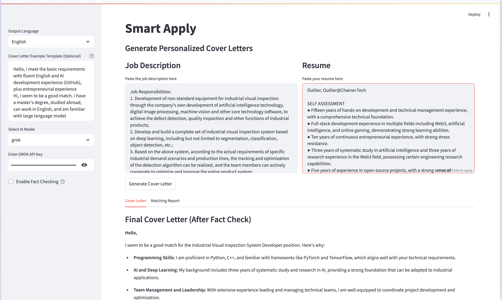

# Smart Apply

Streamline Your Job Application Process With LLM



## Features

* Support for multiple AI models (OpenAI and DeepSeek)
* Configurable default settings for API keys and content
* User-friendly web interface with model selection
* Customizable cover letter generation
* Default templates for job descriptions and resumes
* Client-server architecture for better scalability

## Architecture
The application consists of two main components:
* FastAPI backend server - Handles AI model interactions and core logic
* Streamlit frontend - Provides user interface and interaction

## Installation

1. Clone this repository:

```bash
git clone https://github.com/forchain/smart-apply.git
cd smart-apply
```

2. Create a virtual environment and install the required packages:

```bash
python -m venv venv
source venv/bin/activate  # On Windows, use: venv\Scripts\activate
pip install --upgrade pip  # Ensure pip is up to date

# Install backend dependencies
cd backend
pip install -r requirements.txt

# Install frontend dependencies
cd ../frontend
pip install -r requirements.txt
```

3. Configure the application:

```bash
# Configure backend
cd ../backend
cp config/config.yaml.example config/config.yaml
# Edit config.yaml with your settings

# Configure frontend
cd ../frontend
cp config/config.yaml.example config/config.yaml
# Edit config.yaml with your settings
```

## Running the Application

You have three options to run the application:

### Option 1: Run both services with single command
```bash
./scripts/run.sh  # On Unix-like systems
# or
scripts\run.bat   # On Windows
```

### Option 2: Run services separately
1. Start the FastAPI server:
```bash
cd backend
python main.py
```

2. In a new terminal, start the Streamlit frontend:
```bash
cd frontend
streamlit run app/main.py  # On Unix-like systems

The services will be available at:
* Frontend: http://localhost:8501
* Backend API: http://localhost:8000
* API Documentation: http://localhost:8000/docs

## Configuration
The `config.yaml` file supports the following settings:

```yaml
# AI Model Providers
openai:
  model: gpt-4-turbo-preview
  api_key: your_openai_key_here  # optional
  base_url: https://api.openai.com/v1

deepseek:
  model: deepseek-chat
  api_key: your_deepseek_key_here  # optional
  base_url: https://api.deepseek.com

# Default Templates
defaults:
  resume: |
    # Your default resume template here
    
  jd: |
    # Your default job description template here
```

### Configuration Options:

1. **AI Model Settings**:
   - `model`: Specify the model to use
   - `api_key`: Your API key for the service (can also be entered in UI)
   - `base_url`: API endpoint URL

2. **Default Templates**:
   - `resume`: Default resume template to pre-fill in the UI
   - `jd`: Default job description template to pre-fill in the UI

## API Endpoints

The FastAPI backend provides the following endpoints:

* `POST /generate` - Generate cover letter
  - Request body: job description, resume, API key, and model provider
  - Returns: Generated cover letter

* `GET /config/{provider}` - Get provider configuration
  - Path parameter: AI model provider name
  - Returns: Provider configuration including API key and model settings

For detailed API documentation, visit http://localhost:8000/docs when the server is running.

# Architect
```
smart-apply/
├── backend/
│   ├── app/
│   │   ├── __init__.py
│   │   ├── api/
│   │   ├── core/
│   │   │   ├── __init__.py
│   │   │   ├── config.py         
│   │   │   └── generator.py     
│   │   └── models/
│   │       ├── __init__.py
│   │       └── request.py       # Pydantic models
│   ├── config/
│   │   ├── config.yaml.example
│   │   └── config.yaml
│   ├── requirements.txt
│   └── main.py                  # FastAPI entry 
│
├── frontend/
│   ├── app/
│   │   ├── __init__.py
│   │   ├── config.py           
│   │   └── main.py             # Streamlit app
│   ├── config/
│   │   └── config.yaml
│   └── requirements.txt
│
├── screenshots/                 # Application screenshots
│   ├── main.png
│   ├── generation.png
│   └── model.png
│
├── scripts/
│   ├── run.sh                  # Unix 
│   └── run.bat                 # Windows 
│
├── README.md
└── setup.py
```

## Coming Soon
* Skills gap analysis
* Application tracking
* Multiple resume management
* Application automation
